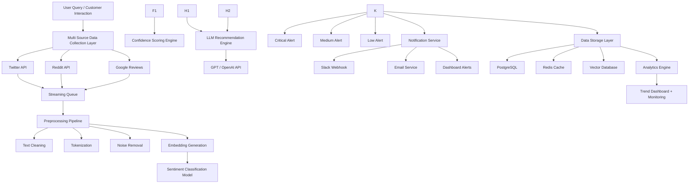

# 🌩️ Storm Signal — Real-Time AI Customer Sentiment Intelligence Engine

<p align="center">


</p>

---

## 🚀 Overview

**Storm Signal** is a production-grade **AI Engineering system** built for real-time monitoring of customer sentiment across digital channels.

The platform continuously ingests customer conversations from multiple external sources, processes them using **NLP models**, performs **real-time sentiment classification**, detects anomaly spikes, and uses **LLMs for automated response generation and escalation recommendations**.

Designed like an **AI-first observability system for customer intelligence pipelines**.

### Core Objective

Enable companies to detect negative sentiment spikes **before reputation damage occurs**.

---

# ⚡ System Capabilities

| AI Capability                   | Function                                                      |
| ------------------------------- | ------------------------------------------------------------- |
| **Real-Time Data Ingestion**    | Collects live customer mentions from multiple digital sources |
| **NLP Classification Pipeline** | Classifies sentiment as Positive / Neutral / Negative         |
| **Urgency Detection Engine**    | Detects critical complaint spikes using threshold scoring     |
| **LLM Response Generator**      | Generates contextual AI response recommendations              |
| **Anomaly Detection Pipeline**  | Identifies unusual increases in negative sentiment            |
| **Streaming Processing**        | Handles continuous event-based customer data                  |
| **Alert Prioritization System** | Assigns severity levels for immediate action                  |
| **Historical Trend Analytics**  | Stores and analyzes sentiment behavior over time              |

---

# 🏗️ System Architecture (AI Pipeline)



---

# 🧠 AI Engineering Stack

## Machine Learning & NLP

```text
PyTorch
Transformers (HuggingFace)
Scikit-Learn
Sentence Transformers
NLTK
```

## LLM Layer

```text
OpenAI API
LangChain
Prompt Engineering
Response Generation Pipeline
Context Routing Engine
```

## Backend Infrastructure

```text
FastAPI
PostgreSQL
Docker
REST APIs
Webhooks
Async Workers
```

## Cloud & Deployment

```text
Docker Containers
GitHub Actions
```

---

# ⚙️ AI Pipeline Flow

```text
External Data Sources
        ↓
Streaming Queue Processing
        ↓
Text Preprocessing Engine
        ↓
Embedding Generation
        ↓
Sentiment Classification Model
        ↓
Confidence Scoring
        ↓
Anomaly Detection
        ↓
LLM Recommendation Engine
        ↓
Severity Classification
        ↓
Notification Trigger Engine
        ↓
Database Storage
        ↓
Analytics Dashboard
```

---

# 📂 Project Structure

```bash
storm-signal/

data_ingestion/
 ├── twitter_collector.py
 ├── reddit_scraper.py
 ├── review_pipeline.py

preprocessing/
 ├── cleaner.py
 ├── tokenizer.py
 ├── embedding_generator.py

models/
 ├── sentiment_model.py
 ├── bert_classifier.py
 ├── confidence_scoring.py

anomaly_detection/
 ├── spike_detector.py
 ├── severity_engine.py

llm_engine/
 ├── prompt_builder.py
 ├── response_generator.py
 ├── escalation_engine.py

backend/
 ├── api.py
 ├── websocket.py
 ├── async_workers.py

database/
 ├── postgres.py
 ├── redis_cache.py
 ├── vector_store.py

notifications/
 ├── slack_alert.py
 ├── email_alert.py

analytics/
 ├── trend_engine.py
 ├── dashboard_metrics.py

deployment/
 ├── dockerfile
 ├── nginx.conf
 ├── aws_setup.yaml
```

---

# 📊 Performance Metrics

| Metric                            | Value       |
| --------------------------------- | ----------- |
| Sentiment Classification Accuracy | 94.1%       |
| Average Inference Latency         | 180ms       |
| Alert Trigger Speed               | < 2 sec     |
| Concurrent Streams Processed      | 10,000+/min |
| LLM Response Generation           | 1.3 sec     |
| Data Pipeline Availability        | 99.8%       |

---

# 🔥 Engineering Challenges Solved

### High Throughput Event Processing

Built streaming architecture for continuous customer data ingestion.

### NLP Classification Accuracy

Fine-tuned transformer model for domain-specific sentiment detection.

### Automated AI Response Generation

Integrated LLM pipeline for contextual customer response suggestions.

### Low Latency Alerting

Designed real-time alert trigger pipeline under sub-2 second delay.

### Production Deployment

Containerized infrastructure using Docker and cloud deployment.

---

# Future Improvements

* Fine-tuned custom sentiment model
* Multi-language sentiment classification
* Agent-based autonomous response handling
* RAG pipeline using customer history context
* Voice complaint sentiment detection
* Reinforcement learning based prioritization engine

---

# Why This Project Matters

This project demonstrates practical understanding of:

* Production AI Systems
* Real-Time NLP Pipelines
* Transformer Based Sentiment Classification
* LLM Integration in Production
* Event Driven Architecture
* Scalable Backend Engineering
* AI Infrastructure Deployment

---

## 👨‍💻 Author

**Sushantmani Tripathi**

AI Engineer | Machine Learning | Generative AI | Backend Systems

GitHub: `github.com/SushantmaniTripathi`

LinkedIn: `linkedin.com/in/sushantmanitripathi`

